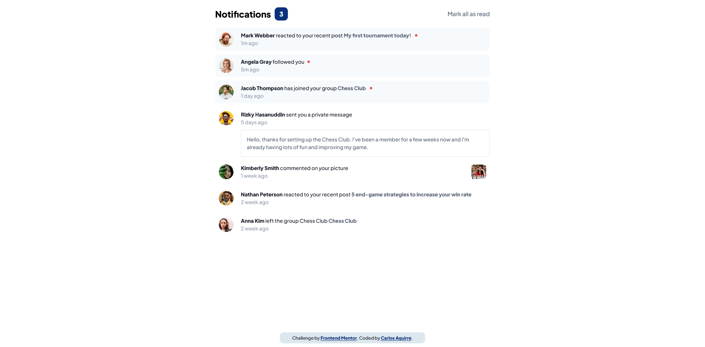
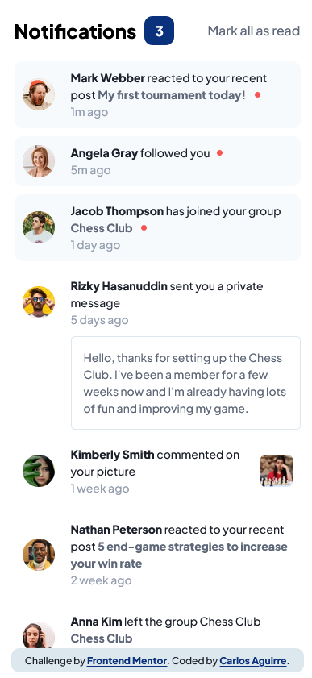

# Frontend Mentor - Notifications page solution

This is a solution to the [Notifications page challenge on Frontend Mentor](https://www.frontendmentor.io/challenges/notifications-page-DqK5QAmKbC).

## Table of contents

- [Overview](#overview)
  - [The challenge](#the-challenge)
  - [Screenshot](#screenshot)
  - [Links](#links)
- [My process](#my-process)
  - [Built with](#built-with)
  - [What I learned](#what-i-learned)
  - [Continued development](#continued-development)
  - [Useful resources](#useful-resources)
- [Author](#author)
- [Acknowledgments](#acknowledgments)

## Overview

### The challenge

Users should be able to:

- Distinguish between "unread" and "read" notifications
- Select "Mark all as read" to toggle the visual state of the unread notifications and set the number of unread messages to zero
- View the optimal layout for the interface depending on their device's screen size
- See hover and focus states for all interactive elements on the page

### Screenshot




### Links

- Solution URL: [Add solution URL here](https://your-solution-url.com)
- Live Site URL: [Add live site URL here](https://your-live-site-url.com)

## My process

### Built with

- HTML5
- CSS custom properties
- Flexbox
- Mobile-first workflow
- [React](https://reactjs.org/) - JS library
- [Vite](https://vitejs.dev/) - Frontend tooling
- [SASS](https://sass-lang.com/) - CSS with superpowers

### What I learned

I was using the pseudo-element `::before` to make the dot/badge that indicates a notification is unread, and it was showing correctly in all elements but the third one, then I remember and changed to `::after` to solve that.

Before:

```scss
&--unread::before {
  content: "";
  position: absolute;
  background-color: $red;
  border-radius: 100%;
  height: 7px;
  width: 7px;
  top: 50%;
  transform: translateY(-50%);
  right: -1.5rem;
}
```

After

```scss
&--unread::after {
  content: "";
  position: absolute;
  background-color: $red;
  border-radius: 100%;
  height: 7px;
  width: 7px;
  top: 50%;
  transform: translateY(-50%);
  right: -1.5rem;
}
```

## Author

- Frontend Mentor - [@yourusername](https://www.frontendmentor.io/profile/carloseag1609)
